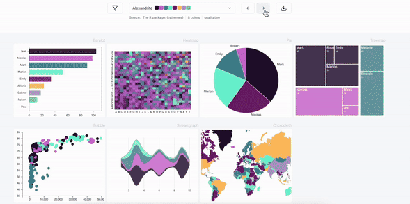
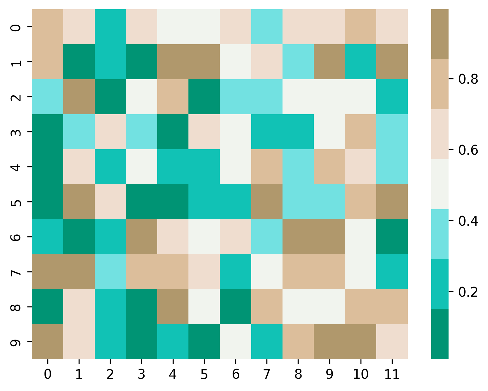
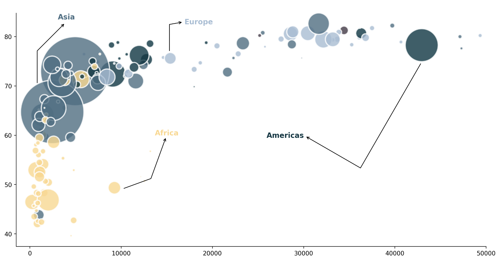

# pypalettes

A large (**+2500**) collection of color maps for Python.

All available palettes can be found [on the dedicated website](https://python-graph-gallery.com/color-palette-finder/)

<center>
   
   
</center>


<br><br>

## Installation

```bash
pip install git+https://github.com/JosephBARBIERDARNAL/pypalettes.git
```

<br><br>

## Quick start

Once the `cmap` is loaded, you can use it as any other color map in `matplotlib` or `seaborn`.

```python
import matplotlib.pyplot as plt
import seaborn as sns
from pypalettes import load_cmap
import numpy as np

data = np.random.rand(10, 12)

cmap = load_cmap('Anemone')

sns.heatmap(data, cmap=cmap)
plt.show()
```



<br><br>

## Getting started

<br>

- Load a color map:

```python
from pypalettes import load_cmap
cmap = load_cmap('Chaetodon_sedentarius')
cmap
```


<br>

- Transform a qualitative color map into a continuous one:

```python
from pypalettes import load_cmap
cmap = load_cmap('Chaetodon_sedentarius', type='continuous')
cmap
```


<br>

- Invert a color map:

```python
from pypalettes import load_cmap
cmap = load_cmap('Chaetodon_sedentarius', reverse=True)
cmap
```


<br>

- Reverse and continuous:

```python
from pypalettes import load_cmap
cmap = load_cmap('Chaetodon_sedentarius', reverse=True, type='continuous')
cmap
```


<br>

- Keep only the first 3 colors of a color map:

```python
from pypalettes import load_cmap
cmap = load_cmap('Chaetodon_sedentarius', keep_first_n=3)
cmap
```


<br>

- Keep only specific colors of a color map:

```python
from pypalettes import load_cmap
cmap = load_cmap('Chaetodon_sedentarius', keep=[True, True, False, False, True])
cmap
```


<br>

- Load a random color map:

```python
from pypalettes import load_cmap 
cmap = load_cmap()
cmap
```


<br>

- Get hex values of a color map:

```python
from pypalettes import get_hex
get_hex('pupitar')
```

`['#7098C0FF',
 '#88C0E8FF',
 '#285880FF',
 '#B8E0F8FF',
 '#F8F8F8FF',
 '#404060FF',
 '#A8A8A8FF',
 '#C8C8D0FF',
 '#B04000FF']`

<br>

- Get rgb values of a color map:

```python
from pypalettes import get_rgb
get_rgb('AirNomads')
```

`[(255, 153, 51),
 (194, 72, 65),
 (255, 255, 51),
 (139, 91, 69),
 (135, 175, 209),
 (238, 176, 90),
 (219, 197, 160)]`

<br>

More examples can be found in the [how to use notebook](https://github.com/JosephBARBIERDARNAL/pypalettes/blob/main/how_to_use.ipynb)

<br><br>

## Chart made with `pypalettes`

*Click on the image to get the associated code!*

<p>
   
   <a href='https://python-graph-gallery.com/web-map-with-custom-legend/'  target="_blank">
      
   </a>

   <a href='https://python-graph-gallery.com/web-stacked-area-with-inflexion-arrows/'  target="_blank">
      
   </a>

   <br/>

   <a href='https://python-graph-gallery.com/591-arrows-with-inflexion-point/'  target="_blank">
      
   </a>

</p>

<br><br>

## Related projects

`pypalettes` is **highly** inspired from the R package [paletteer](https://github.com/EmilHvitfeldt/paletteer) and the python package [palettable](https://github.com/jiffyclub/palettable).

<br><br>

## How data has been collected

- Sites used
   - https://coolors.co/palettes/trending
   - https://pmassicotte.github.io/paletteer_gallery/

[Learn more in the dedicated directory](parsers/README.md)

<br><br>