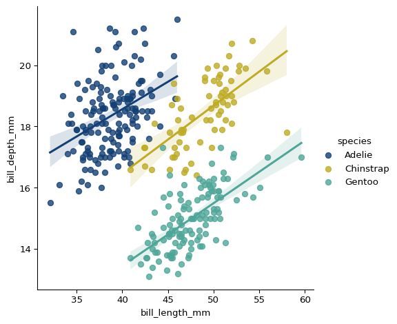
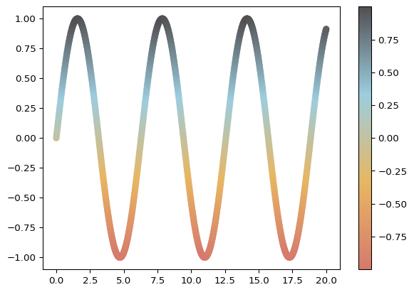

# PyPalettes


<!-- Automatically generated, uses README.qmd to modify README.md -->


A large (**+2500**) collection of color maps for Python.

- All available palettes can be found in the [Color Palette
  Finder](https://python-graph-gallery.com/color-palette-finder/).
- To learn more about how to use `pypalettes`, please refer to the
  [official
  documentation](https://python-graph-gallery.com/introduction-to-pypalettes/).


<center align="left">


</center>

> This package is based on the R package
> [paletteer](https://github.com/EmilHvitfeldt/paletteer), and all
> associated sub-packages (with original palettes) mentioned in the
> [LICENSE](LICENSE.note) file.

<br><br>

## Installation

With pip:

``` bash
pip install pypalettes
```

With conda:

``` bash
conda install conda-forge::pypalettes
```

<br><br>

## Quick start

Once `pypalettes` is imported, all the palettes are now accessible as
any other colormap in matplotlib or seaborn via the `palette` or `cmap`
arguments.

#### Continuous palette

``` python
import matplotlib.pyplot as plt
import numpy as np
from pypalettes import load_cmap

cmap = load_cmap("Sunset2", cmap_type="continuous")

data = np.random.randn(20, 20)

plt.imshow(data, cmap=cmap)
plt.colorbar()
```


#### Categorical palette

``` python
import matplotlib.pyplot as plt
import seaborn as sns
from pypalettes import load_cmap

cmap = load_cmap("Fun")
palette = cmap.colors # return colors as a list of hexadecimal values

df = sns.load_dataset("penguins")

g = sns.lmplot(
    data=df,
    x="bill_length_mm",
    y="bill_depth_mm",
    hue="species",
    palette=palette,
)
```



#### Your own palette

``` python
import matplotlib.pyplot as plt
from pypalettes import create_cmap
import numpy as np

cmap = create_cmap(
    colors=["#D57A6DFF", "#E8B762FF", "#9CCDDFFF", "#525052FF"],
    cmap_type="continuous",
)

x = np.linspace(0, 20, 1000)
y = np.sin(x)

plt.scatter(x, y, c=y, cmap=cmap)
plt.colorbar()
```



[Going
further](https://python-graph-gallery.com/introduction-to-pypalettes/)

<br><br>

## Features

- Add +2500 native palettes to matplotlib and seaborn
- Load, customise and combine +2500 palettes
- Create your own palettes

To find out more about using PyPalettes, use this [PyPalettes
guide](https://python-graph-gallery.com/introduction-to-pypalettes/).

<br><br>

## Chart made with `pypalettes`

*Click on the image to get the associated code!*

<p>

<a href='https://python-graph-gallery.com/web-map-with-custom-legend/'  target="_blank">
 </a>

<a href='https://python-graph-gallery.com/web-stacked-area-with-inflexion-arrows/'  target="_blank">
 </a>

<br/>

<a href='https://python-graph-gallery.com/591-arrows-with-inflexion-point/'  target="_blank">
 </a>

<a href='https://python-graph-gallery.com/web-lollipop-with-colormap-and-arrow/'  target="_blank">
 </a>

</p>

<br><br>

## Acknowledgements

`PyPalettes` is **highly** inspired (and relies on for the first one)
from

- the R package [paletteer](https://github.com/EmilHvitfeldt/paletteer)
- the python library
  [palettable](https://github.com/jiffyclub/palettable)

A big thanks to [Yan Holtz](https://www.yan-holtz.com/) for creating the
Color Palette Finder, a [web app for browsing
palettes](https://python-graph-gallery.com/color-palette-finder/)

<br><br>
