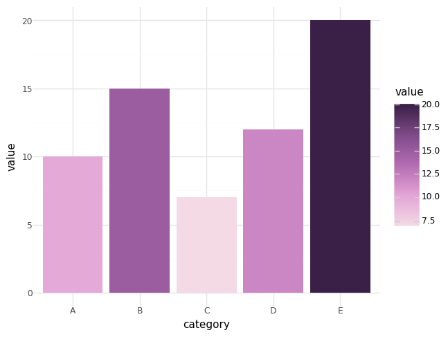

# Example usage

`pypalettes` offers 3 functions:

- [`load_cmap()`](../reference/load_cmap){target="\_blank"}: the core function that loads a colormap from one of the 2500+ available palettes. All available palettes can be found in the [Color Palette Finder](https://python-graph-gallery.com/color-palette-finder/){target="\_blank"}.
- [`create_cmap()`](../reference/create_cmap){target="\_blank"}: a function to create your own colormaps from a list of colors.
- [`show_cmap()`](../reference/show_cmap){target="\_blank"}: a function to preview the colors of a given palette.

Since those functions are built for matplotlib, they work with **any matplotlib-based plotting library** (seaborn, plotnine, (geo)pandas, cartopy, statsmodels, etc).

Also, you have to understand the **difference** between a _palette_ and a _colormap_ (or cmap).

- _palette_: a list of colors, such as
  ["<span style="font-size:0.8em; background-color:#D57A6D; padding:1px 1px; border-radius:2px; color:white;">#D57A6D</span>",
  "<span style="font-size:0.8em; background-color:#E8B762; padding:1px 1px; border-radius:2px;">#E8B762</span>",
  "<span style="font-size:0.8em; background-color:#9CCDDF; padding:1px 1px; border-radius:2px;">#9CCDDF</span>",
  "<span style="font-size:0.8em; background-color:#525052; padding:1px 1px; border-radius:2px; color:white;">#525052</span>"]. It's not necessarly related to data visualization, but design in general.
- _colormap_: in the context of `matplotlib`, this a special object that **contains** colors and can be used to **map colors and values**.

Let's see how to use them in concrete examples!

## `load_cmap()`

- In matplotlib

```py
# mkdocs: render
import matplotlib.pyplot as plt
from pypalettes import load_cmap

cmap = load_cmap("Acadia")

x = [1, 2, 3, 4, 5, 6, 7, 8, 9]
y = [2, 1, 4, 3, 5, 7, 6, 9, 8]
c = [1, 3, 1, 2, 3, 2, 1, 3, 2]

fig, ax = plt.subplots()
ax.scatter(x, y, c=c, s=500, cmap=cmap)
```

- In seaborn

```py
# mkdocs: render
import seaborn as sns
from pypalettes import load_cmap

cmap = load_cmap("Fun")
palette = cmap.colors # list of colors

df = sns.load_dataset("penguins")

g = sns.lmplot(
    data=df,
    x="bill_length_mm",
    y="bill_depth_mm",
    hue="species",
    palette=palette,
)
```

- In plotnine

```py
# mkdocs: render
import pandas as pd
from plotnine import ggplot, aes, geom_bar, theme_minimal, scale_fill_gradientn
from pypalettes import load_cmap

df = pd.DataFrame({
    "category": ["A", "B", "C", "D", "E"],
    "value": [10, 15, 7, 12, 20]
})

colors = load_cmap("Arches2", reverse=True).colors

(
    ggplot(df, aes(x="category", y="value", fill="value"))
    + geom_bar(stat="identity")
    + scale_fill_gradientn(colors=colors)
    + theme_minimal()
)
```



## `create_cmap()`

This function just requires a list of colors, and then you can use its output the same way as `load_cmap()`:

- Create a categorical colormap

```py
# mkdocs: render
import matplotlib.pyplot as plt
from pypalettes import create_cmap
import numpy as np

cmap = create_cmap(["#D57A6D", "#E8B762", "#9CCDDF", "#525052"])

x = np.linspace(0, 20, 1000)
y = np.sin(x)

plt.scatter(x, y, c=y, cmap=cmap)
plt.colorbar()
```

<br>

- Create a continuous colormap

```py
# mkdocs: render
import matplotlib.pyplot as plt
from pypalettes import create_cmap
import numpy as np

cmap = create_cmap(
    ["#D57A6D", "#E8B762", "#9CCDDF", "#525052"],
    cmap_type="continuous",
)

x = np.linspace(0, 20, 1000)
y = np.sin(x)

plt.scatter(x, y, c=y, cmap=cmap)
plt.colorbar()
```

## `show_cmap()`

Finally, the utility function to preview the colors from a colormap.

```py
# mkdocs: render
from pypalettes import show_cmap

show_cmap("Fun")
```

```py
# mkdocs: render
from pypalettes import show_cmap

show_cmap("FridaKahlo")
```

```py
# mkdocs: render
from pypalettes import show_cmap

show_cmap("Sunset2")
```
